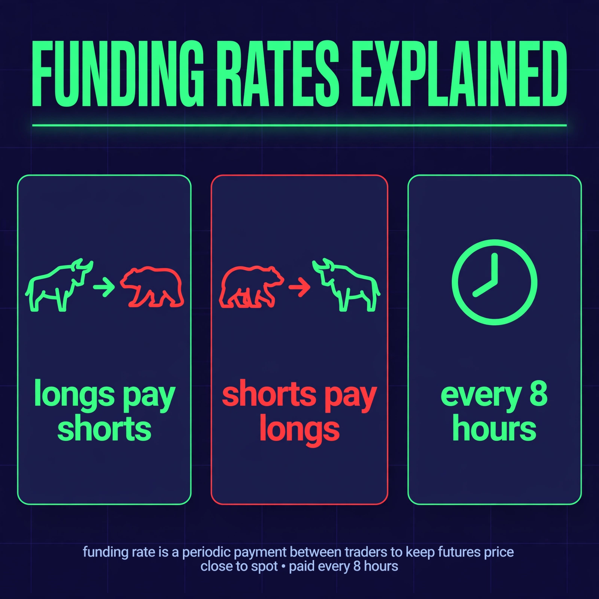
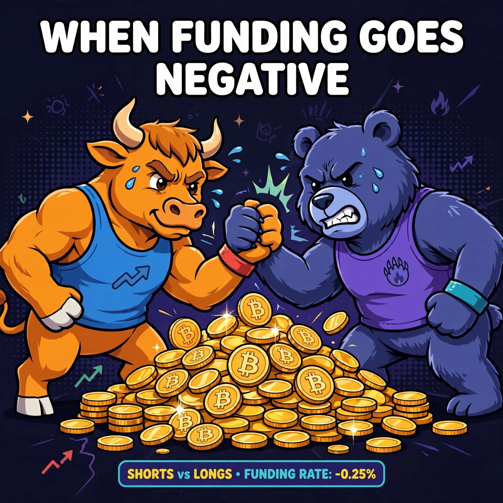

# Portfolio — Crypto Content & Design

Content writer & designer working across crypto. I turn complex on-chain ideas into content people actually read — and visuals they actually remember.

Based in Spain · Remote across EU time zones · 中英双语

---

## Writing Samples

### 1. X Thread — "I scanned 2,100 Polymarket events for arbitrage"

An 8-post thread on prediction-market arbitrage: why most scanner "edges" are stale quotes, why whale wallets aren't smart money, and why the edge is in execution, not discovery. Written from a real day of running an arbitrage scanner.

> "A scanner without live book verification is a hope machine."

[Read the thread →](./thread-polymarket-arbitrage.md)

### 2. Blog — "Funding Rates: The Invisible Hand Moving Billions in Crypto"

~800 words. Explains perpetual-futures funding rates for curious newcomers: what funding is, who pays whom, why smart money watches funding instead of price — and the three catches nobody mentions.

[Read the article →](./blog-funding-rates.md)

---

## Design Samples

### 3. Infographic — "Funding Rates Explained"

Educational social graphic: three panels breaking down longs-pay-shorts / shorts-pay-longs / every-8-hours settlement. Companion piece to the blog post above.

### 4. Meme Graphic — "When Funding Goes Negative"

Crypto-native meme style: bull vs. bear arm-wrestling over BTC. Made for X/Twitter engagement.

---

## Contact

- Portfolio: this repo
- Open to: full-time, part-time, contract — content, social, community roles
