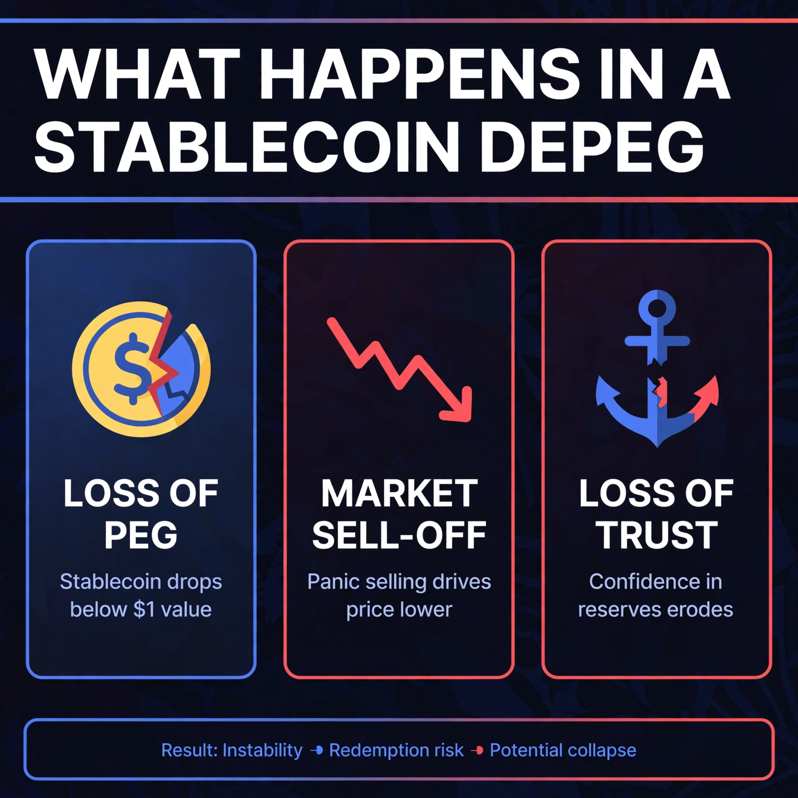
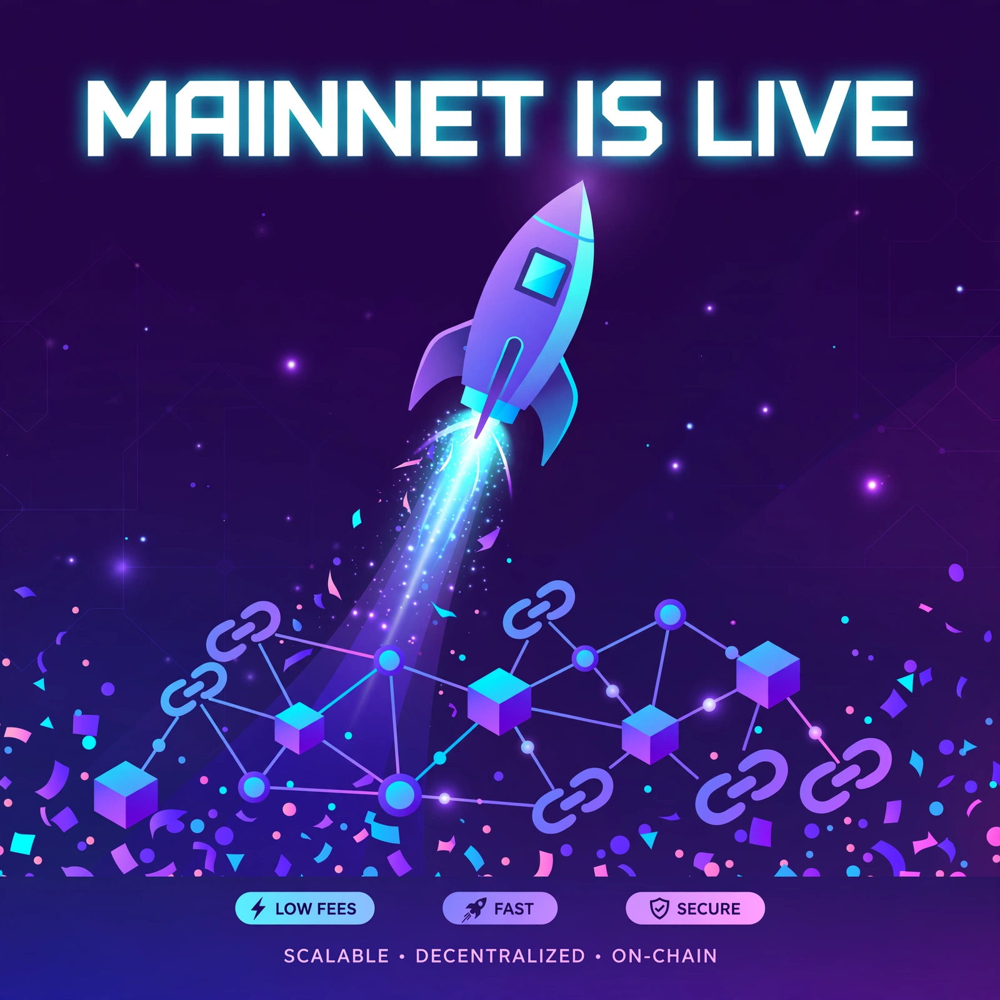

# Portfolio — Crypto Content & Design

> I turn complex on-chain ideas into content people actually read — and visuals they actually remember.

**laifq71-art** · Based in Spain · Remote across EU time zones · 中英双语

---

## What I do

| | |
|---|---|
| ✍️ **Content writing** | X threads, blogs, explainers — DeFi, prediction markets, stablecoins |
| 🎨 **Social design** | Infographics, announcement graphics, memes — crypto-native visual language |
| 🗺️ **Content strategy** | Launch plans, content pillars, channel mix, KPIs |

---

## Selected work

### Writing

| Piece | Description |
|---|---|
| [X Thread — "I scanned 2,100 Polymarket events for arbitrage"](./thread-polymarket-arbitrage.md) | 8-post thread on prediction-market arbitrage, written from real scanner data. Why most "edges" are stale quotes, why whales aren't smart money. |
| [X Thread — 中文版](./thread-polymarket-arbitrage-cn.md) | Same thread in Chinese — I work bilingually (EN/ZH). |
| [Blog — "Funding Rates: The Invisible Hand Moving Billions in Crypto"](./blog-funding-rates.md) | ~800 words. Perpetual-futures funding rates explained for curious newcomers. |
| [Blog — "Stablecoin Depegs: What Actually Happens When a Dollar Isn't a Dollar"](./blog-stablecoin-depegs.md) | ~750 words. Anatomy of a depeg, plus a checklist for evaluating any peg. |

### Strategy

| Piece | Description |
|---|---|
| [Spec — 30-Day Content Plan for a DeFi Protocol Launch](./content-plan-defi-launch.md) | Full launch content strategy: pillars, week-by-week plan, channel mix, KPIs. *Spec work.* |

### Design

| | |
|---|---|
|  | **"Funding Rates Explained"** — educational infographic, companion to the blog post. |
|  | **"What Happens in a Stablecoin Depeg"** — three-panel explainer. |
|  | **"When Funding Goes Negative"** — meme-style engagement graphic. |
|  | **"Mainnet Is Live"** — launch announcement graphic. |

---

## How I work

1. **Research first** — every piece starts from real data (scanner logs, on-chain stats, docs), not vibes.
2. **One idea per piece** — a thread makes one argument; a graphic says one thing.
3. **Write for skimmers** — headers, panels, and captions carry the meaning; the body is for the curious.
4. **Ship fast, iterate** — draft in a day, refine from feedback. Crypto moves too fast for perfectionism.

---

## About

<!-- TODO: replace with your real intro, 3–4 lines. Example structure:
     who you are + years doing content/design + one proof point (audience grown, project shipped) -->

Content writer & designer in crypto. I work in English and Chinese, across EU time zones.

## Contact

<!-- TODO: add your email / Telegram / X handle -->

- GitHub: [@laifq71-art](https://github.com/laifq71-art)
- Open to: full-time, part-time, contract — content, social, community roles
